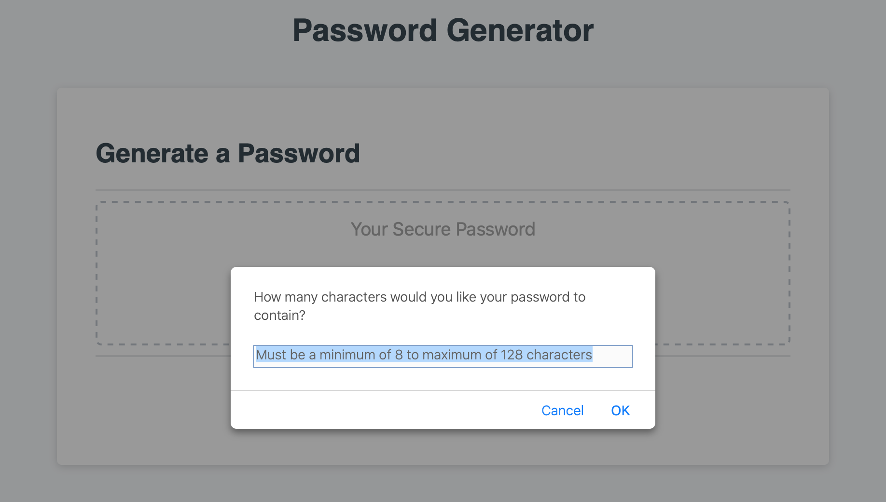
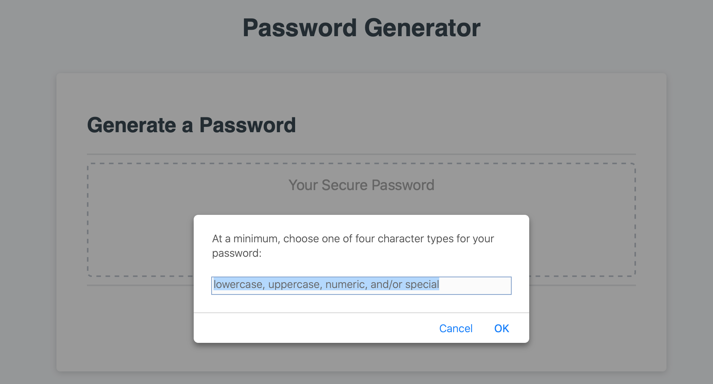
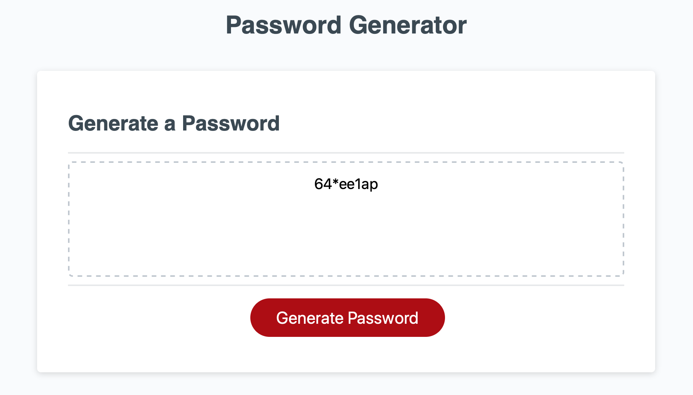

# password-generator

This site randomly generates a password based on user preferences. The site takes in user input to display a randomly generated password.

## Functionality

When the generate password button is pressed, the user is prompted to enter how long they would like their password to be ranging from 8 to 128 characters. Then they are prompted to select what type of characters they would like to use in the password. These include letters both upper and lowercase, numbers and/or special characters. After the user makes their selection, a password is randomly generated based on their preferences.

## Built With

* [HTML](https://developer.mozilla.org/en-US/docs/Web/HTML)
* [CSS](https://developer.mozilla.org/en-US/docs/Web/CSS)
* [JavaScript](https://developer.mozilla.org/en-US/docs/Web/JavaScript)

## Deployed Link

* [See Live Site](https://trevcoons.github.io/password-generator/)

## Authors

* **Trevor Coons** 

- [Link to Portfolio Site](https://trevcoons.github.io/trevors-portfolio/)
- [Link to Github](https://github.com/trevcoons)
- [Link to LinkedIn](www.linkedin.com/in/trevor-coons-2a948a104)

## Acknowledgments

Thanks to UC Berkeley Coding Bootcamp for teaching me HTML, CSS and JavaScript.
